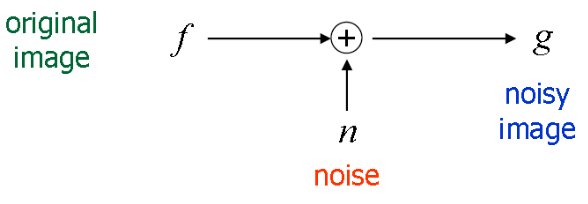
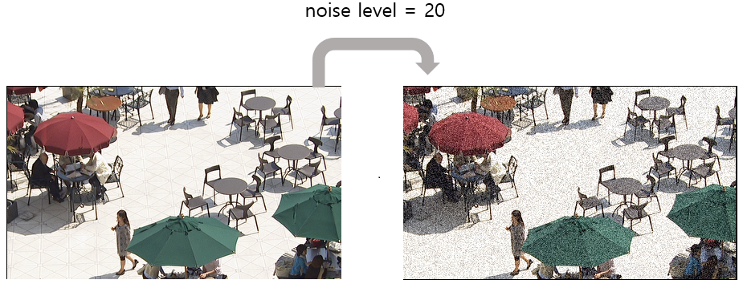
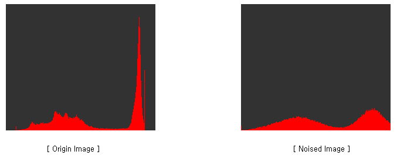
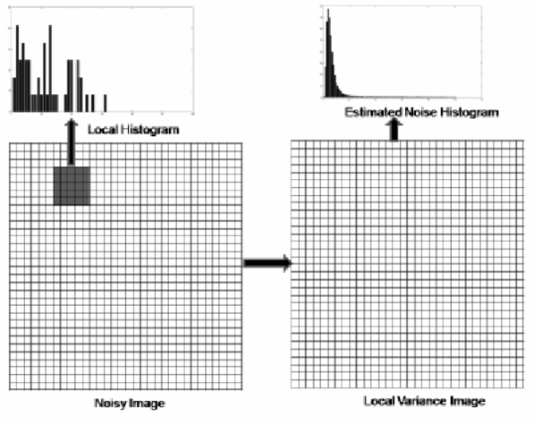
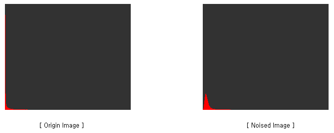

# NoiseAnalyzer
NoiseAnalyzer - Gaussian Noise Analyze ( support Hevc all-intra Compression Noise )

# Noise Modeling

we can design following noise model.

# Generate Gaussian Noise 

define Noise Level and generate gaussian noise.

# Display Histogram

Histogram is used as a way to analyze noise. 

## Pixel Histogram

Available when setting window size to 1. 

## Local Variance Histogram

1. set window size ! 
2. The local variance image is obtained as shown below. 

# Demo

# Reference

* Local Variance histogram figure
  * <https://www.researchgate.net/figure/Noise-histogram-estimation_fig1_46137484> 

